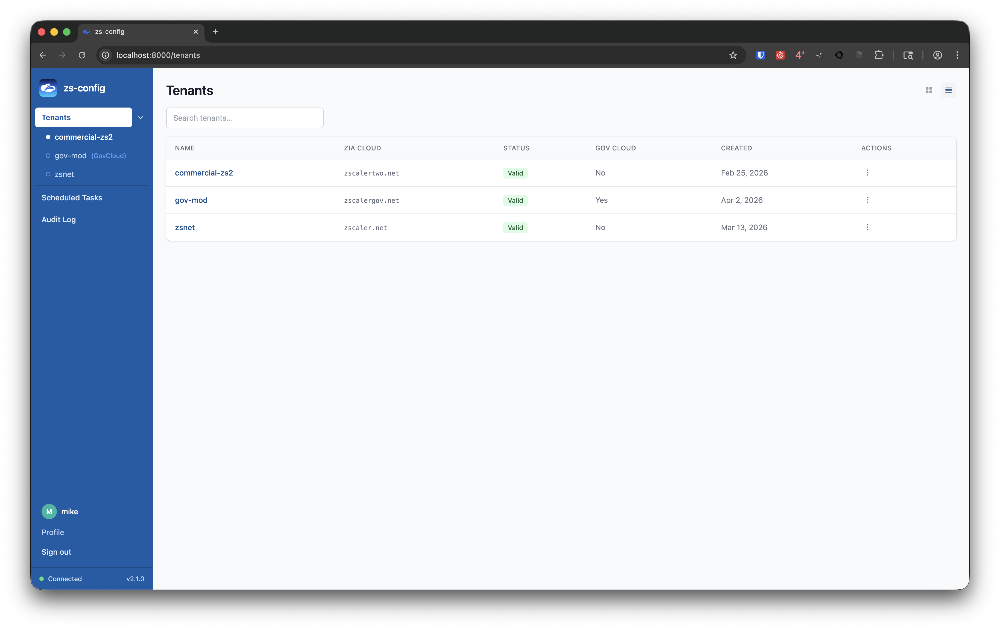
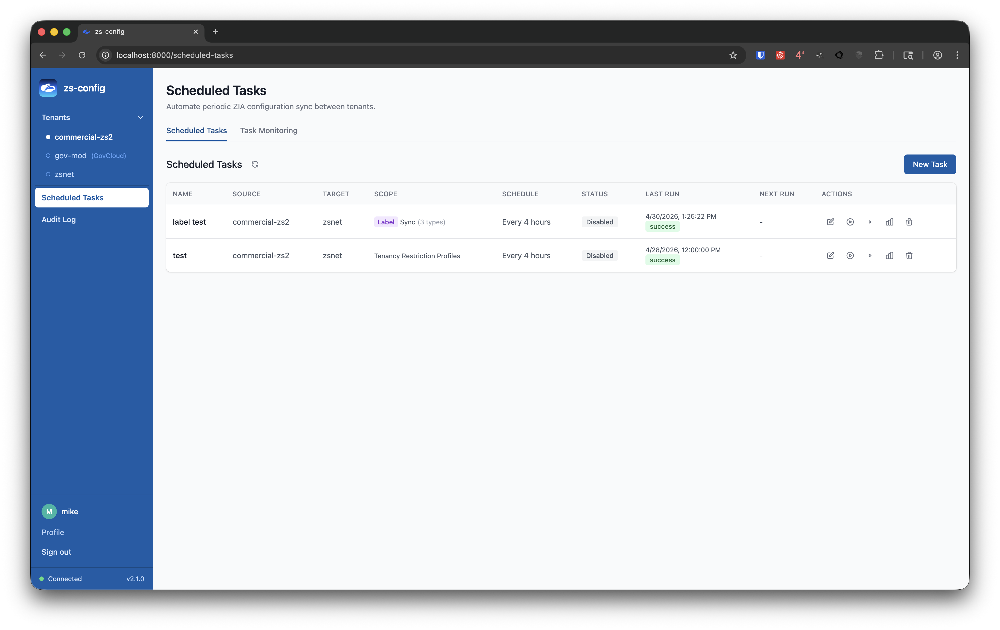
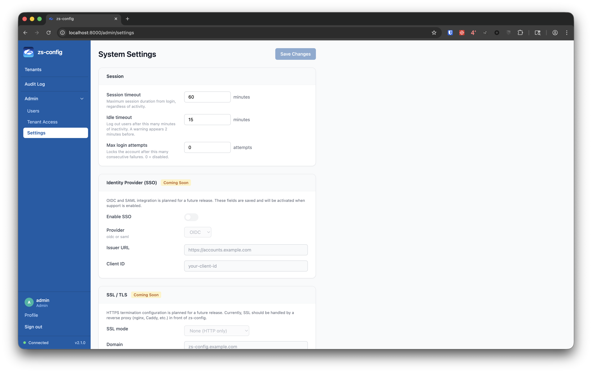
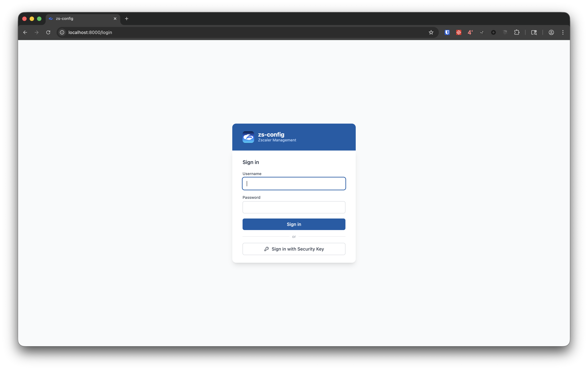

# zs-config

[](https://pypi.org/project/zs-config/)


Interactive TUI and browser-based UI for Zscaler OneAPI — manage ZPA, ZIA, ZCC, ZDX, and ZIdentity from the terminal or a self-hosted web interface, with a local SQLite cache for fast lookups and bulk operations.

---

## What's New — v3.0.0

> **v3.0.0 is the current release** — full SQLite database encryption via SQLCipher. This is a breaking change for native TUI users (requires `libsqlcipher`). See the [changelog](CHANGELOG.md) for details.

- **Full database encryption** — the entire SQLite database file is now encrypted with SQLCipher (AES-256-CBC). Previous versions only encrypted tenant secrets at the column level; v3.0.0 encrypts every row and every table at rest. Existing plaintext databases are migrated automatically on first launch — a `.plaintext.bak` backup is retained until you manually delete it.
- **Key rotation re-encrypts the database file** — `PRAGMA rekey` is issued alongside column re-encryption so the full-database key and the column key rotate atomically.
- **Native TUI users: system dependency required** — `libsqlcipher` must be installed before upgrading. The TUI auto-updater handles this automatically (brew on macOS; apt/dnf/pacman/zypper on Linux). Docker deployments are unaffected.
- **Docker: no changes required** — `libsqlcipher` and `sqlcipher3` are bundled in the container image. Run `./deploy.sh` to rebuild.

---

## Screenshots

<table>
<tr>
<td></td>
<td></td>
</tr>
<tr>
<td align="center"><em>Multi-tenant dashboard</em></td>
<td align="center"><em>Scheduled cross-tenant sync</em></td>
</tr>
<tr>
<td></td>
<td></td>
</tr>
<tr>
<td align="center"><em>Admin settings (session, IdP, SSL, clear data)</em></td>
<td align="center"><em>Sign in — password or hardware security key</em></td>
</tr>
</table>

---

## Deploy

Requires Docker with Compose v2. Download and run the deploy script — it handles cloning, secret generation, volumes, build, and startup automatically.

**Linux / macOS:**

```bash
curl -fsSL https://raw.githubusercontent.com/mpreissner/zs-config/main/deploy.sh -o deploy.sh
bash deploy.sh
```

**Windows (PowerShell, run as Administrator):**

```powershell
Invoke-WebRequest -Uri https://raw.githubusercontent.com/mpreissner/zs-config/main/deploy.ps1 -OutFile deploy.ps1
.\deploy.ps1
```

Both scripts clone the repo if needed, generate a `JWT_SECRET`, create persistent Docker volumes, build the image, and run a health check.

On first boot the container seeds an `admin` account with a random temporary password:

```bash
docker compose logs | grep "Initial password"
```

You will be prompted to set a permanent password on first login.

**Subsequent deploys** (pull latest and rebuild): just run `./deploy.sh` or `.\deploy.ps1` again.

### Upgrade from v1.x TUI

Export your existing database and encryption key, then import via **Admin → Settings → Import Database**:

```bash
./scripts/export_tui_db.sh ~/zs-config-export
```

Upload `zscaler.db` and `secret.key` from that directory. All schema migrations are applied automatically.

---

## Web UI Features

All data is read from the local SQLite cache. Use **Import** in any product tab to refresh from the live API.

**ZIA — Internet Access**
Activation, URL Filtering, URL Categories, URL Lookup, Cloud App Instances, Tenancy Restrictions, Cloud App Rules, Advanced Settings, Allow/Deny Lists, Firewall Policy (with CSV export/sync), DNS Filter, IPS Rules, SSL Inspection, Forwarding Rules, Users/Locations/Departments/Groups, DLP Engines/Dictionaries/Web Rules, Config Snapshots (save/restore), **Apply Snapshot from Another Tenant** (delta or wipe-first, with preview, streaming progress, mid-push stop and rollback), **Policy Templates** (create portable baselines from snapshots; preview included/stripped resources; apply to any tenant), **Scheduled Tasks** (cron-driven cross-tenant sync by resource type or label)

**ZPA — Private Access**
App Connectors, Service Edges, Application Segments, Segment Groups, Browser Access Certificates, PRA Portals

**ZDX — Digital Experience**
Device Search (health metrics), User Lookup (ZDX score, device count)

**ZCC — Client Connector**
All Devices (list/search/OTP), Trusted Networks, Forwarding Profiles, App Profiles, Bypass App Services

**ZIdentity**
Users, Groups (with members), API Clients (details and secrets)

**Admin (admin-only)**
User Management, Tenant Entitlements, System Settings (session timeout, idle timeout, login attempts, audit retention, IdP, SSL mode), Clear Data, Import Database

---

## Session Security

- Short-lived JWT (5 min) renewed silently against an httpOnly refresh cookie (60 min absolute, never extended)
- All tokens invalidated immediately on container restart
- Idle timeout: configurable inactivity threshold (default 15 min) triggers a 2-minute warning, then automatic logout
- Hardware security key support (WebAuthn/passkey) — register a YubiKey or platform authenticator from your profile page

---

## TUI Features

- **ZPA** — App Connectors & Groups (full CRUD), Application Segments (list/search/enable-disable/bulk-create from CSV), Segment Groups, Access Policy (export/import-sync from CSV with dry-run and bulk reorder), PRA Portals & Consoles, Service Edges, Certificate Management, Identity & Directory (SAML, SCIM), reference exports
- **ZIA** — URL Filtering, URL Categories, Security Policy (allowlist/denylist), URL Lookup, Firewall Policy (L4/DNS/IPS — list/search/enable-disable/CSV export/sync), SSL Inspection, Traffic Forwarding, Locations, Users, DLP Engines/Dictionaries/Web Rules, Cloud App Control (full CRUD), Config Snapshots, Apply Snapshot from Another Tenant, IP Group Management (full CRUD + CSV), Activation
- **ZCC** — Devices (list/search/remove/OTP/password lookup/CSV export), Trusted Networks, Forwarding Profiles, Admin Users, Entitlements, App Profiles, Bypass App Definitions
- **ZDX** — Device health, app performance, user lookup, application scores, deep trace
- **ZIdentity** — Users (list/search/reset-password/set-password/skip-MFA), Groups, API Clients
- **Config Import** — 27 ZPA + 42 ZIA + 6 ZCC resource types into a local SQLite cache with SHA-256 change detection
- **Config Snapshots** — save, compare (field-level diff), restore (ZIA only, wipe-or-delta, cross-tenant), delete
- **Audit Log** — immutable record of every operation with full-text search
- **Encryption at rest** — full SQLite database encryption via SQLCipher (AES-256-CBC); tenant secrets additionally encrypted at the column level (Fernet/AES-256-GCM/ChaCha20); key rotation, FIPS mode, and auto-rotation available via Admin Settings or TUI
- **Auto-update** — silent PyPI check on startup; shows changelog and upgrades in-place

---

## Architecture

```
zs-config/
├── lib/               # Low-level API clients (no business logic, no DB)
├── db/                # SQLAlchemy models and session manager
├── services/          # Business logic — shared by CLI and API
├── cli/               # TUI entry point and menus
├── api/               # FastAPI REST backend + static frontend
└── web/               # React + Vite + Tailwind frontend source
```

| Layer | Key files |
|---|---|
| API clients | `lib/zpa_client.py`, `zia_client.py`, `zcc_client.py`, `zdx_client.py`, `zidentity_client.py` |
| DB models | `db/models.py` — TenantConfig, ZPA/ZIA/ZCCResource, RestorePoint, AuditLog, SyncLog, WebUser, Setting |
| Services | `services/zia_push_service.py`, `zpa_policy_service.py`, `zia_import_service.py`, etc. |
| API routers | `api/routers/` — tenants, zia, zpa, zcc, zdx, zid, auth, admin, system |
| Frontend | `web/src/pages/` — TenantWorkspacePage, AdminSettingsPage, ScheduledTasksPage, AuditPage |

---

## Installation

### TUI only (no Docker)

v3.0.0+ requires `libsqlcipher` on your system before installing. The TUI auto-updater installs it for you if you upgrade from within the TUI, but for a fresh install run the appropriate command first:

| Platform | Command |
|---|---|
| macOS | `brew install sqlcipher` |
| Debian/Ubuntu | `sudo apt-get install libsqlcipher-dev` |
| Fedora/RHEL | `sudo dnf install sqlcipher-devel` |
| Arch | `sudo pacman -S sqlcipher` |
| openSUSE | `sudo zypper install sqlcipher-devel` |

```bash
pipx install zs-config   # recommended
# or
pip install zs-config

zs-config
```

On first launch an encryption key is generated at `~/.config/zs-config/secret.key` and the database is created encrypted. Go to **Settings → Add Tenant**, then run **Import Config** to populate the local cache.

### TUI inside the Docker container

```bash
docker exec -it zs-config /bin/bash
python -m cli.z_config
```

### Dev setup

```bash
git clone https://github.com/mpreissner/zs-config.git
cd zs-config
pip install -e .
zs-config
```

### Environment overrides

| Variable | Default | Purpose |
|---|---|---|
| `ZSCALER_SECRET_KEY` | auto-generated | Fernet key for secret encryption (legacy override) |
| `ZSCALER_DB_URL` | `~/.local/share/zs-config/zscaler.db` | SQLAlchemy DB URL |
| `ZSCALER_DB_PATH` | — | Path to the SQLite `.db` file; key file stored in the same directory |
| `ZS_TUI_ONLY` | `0` | Set to `1` to launch the TUI directly instead of the web server |
| `REQUESTS_CA_BUNDLE` | system trust store | PEM CA bundle for outbound HTTPS |

**SSL inspection:** zs-config uses the OS native trust store via `truststore` (macOS Keychain, Windows Certificate Store), so corporate inspection certs are trusted without any configuration. Alternatively, drop a PEM file at `~/.config/zs-config/ca-bundle.pem`.

---

## Known Issues

### Smart Browser Isolation — cannot be enabled via API

**Symptom:** Pushing `browser_control_settings` with `enableSmartIsolation: true` appears to succeed (HTTP 200), but Smart Browser Isolation remains disabled.

**Cause:** The ZIA API accepts the payload but does not honour the toggle. This is a Zscaler platform limitation.

**Workaround:** Enable Smart Browser Isolation manually in the ZIA admin console after pushing a baseline. All other `browser_control_settings` fields push correctly.

**Rule ordering:** When the source tenant has Smart Isolation enabled (rule at order 1) but the target does not, the push renumbers remaining SSL Inspection rules to fill the gap.

---

### Cross-Cloud Baseline Push — Commercial to GovCloud

**Symptom:** Pushing a commercial ZIA baseline to a GovCloud tenant produces significant errors.

**Cause:** API path differences, resource ID namespacing differences, and GovCloud-specific resource types. Under investigation.

**Workaround:** Use Import Config to populate the local DB from the GovCloud tenant directly, then use that as the snapshot source. Same-cloud pushes (commercial → commercial, GovCloud → GovCloud) are unaffected.

---

### SDK known issues (zscaler-sdk-python)

| Area | Issue | Workaround |
|---|---|---|
| ZIA — Browser Isolation | `list_profiles()` omits `profileSeq` | Direct HTTP against `/zia/api/v1/browserIsolation/profiles` |
| ZIA — URL Categories | No `/urlCategories/lite` equivalent | Direct HTTP |
| ZCC — Disable Reasons | Content-type validation rejects actual response format | Direct HTTP, raw bytes |
| ZCC — Entitlements | `update_zpa/zdx_group_entitlement()` sends empty body | Direct HTTP PUT with actual payload |
| ZIdentity — Password/MFA | `reset_password`, `update_password`, `skip_mfa` not in SDK | Direct HTTP against `/ziam/admin/api/v1/users/{id}:*` |
| ZDX — Device apps | Model deserializes array as single object (all fields `None`) | `resp.get_body()` to bypass broken model |
| ZDX — List methods | Returns wrapper object instead of item list | Unwrap via `result[0].devices` / `result[0].users` |
