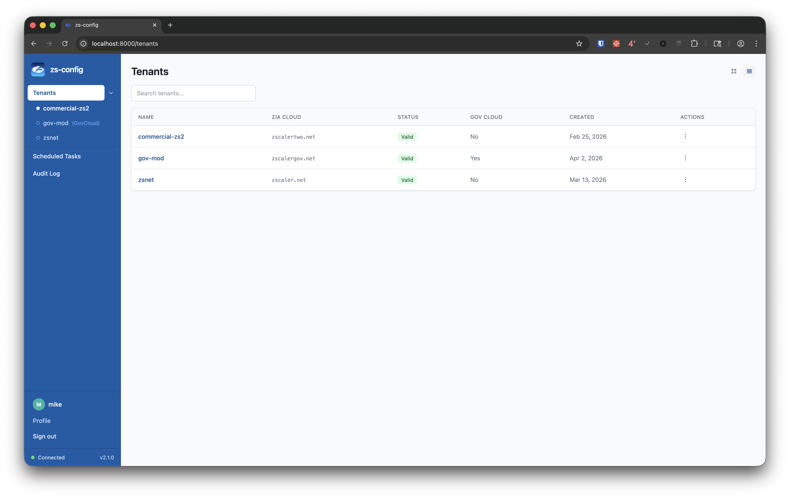
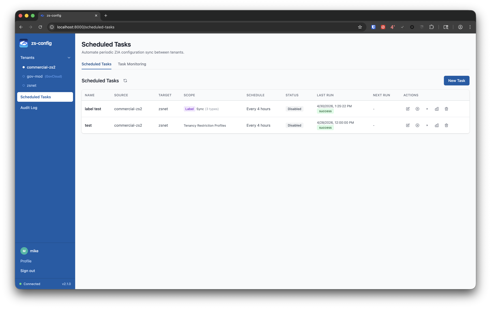
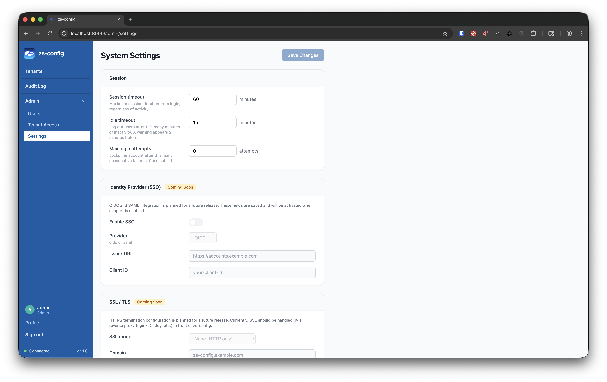
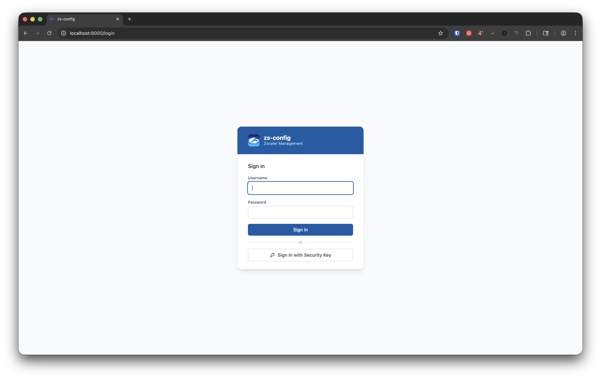

# zs-config

[](https://github.com/mpreissner/zs-config/releases/latest)


Interactive TUI and browser-based UI for Zscaler OneAPI — manage ZPA, ZIA, ZCC, ZDX, and ZIdentity from the terminal or a self-hosted web interface, with a local SQLite cache for fast lookups and bulk operations.

---

## What's New — v3.5.2

> **v3.5.2 is the current release.** See the [changelog](CHANGELOG.md) for full details.

- **Admin and user stay separated** — an account holding both roles could, while acting as admin, click a tenant tile and land in tenant configuration. Tenant configuration is now refused for an admin session outright, and a template is applied by its owner rather than by whoever is looking at it: an admin sees only templates whose owner is gone, to hand one to an account that can use it or delete it. Deprovisioning an account, by admin or by SCIM, releases the templates it owned into that queue. Import stays available to an admin — pre-loading a tenant before its first user arrives is a management function.
- **Pick individual settings toggles** — ZIA keeps advanced settings, URL & cloud app settings, and browser control settings as one object each, holding dozens of unrelated toggles. A scoped template can now name the keys it wants rather than carrying the whole object, and applying it merges those keys over the target's live settings and leaves the rest alone.
- **Templates have owners and can be shared** — a template belongs to the account that created it and is visible only to that account until it is shared, per template, to users or groups.
- **Scoped resource selection** — a template no longer has to carry a whole snapshot. Pick the resources you want out of one and the template stores only those. Wipe mode is refused for a scoped template: it deletes everything the baseline does not name, which would empty the tenant.
- **Proxy chaining** — proxies, proxy gateways, and root certificates are imported, the certificates with their PEM. Certificates and proxies push; the gateway has no write endpoint, so it and the PROXYCHAIN forwarding rule above it are reported as manual build steps rather than dropped without a word.
- **A scoped apply is faster** — it used to read all 53 resource types twice to pick up changes in a handful. Both passes are narrowed to what the template can touch, plus the types reference resolution needs. On a six-type template against a live tenant, the import time in an apply drops from roughly 131s to 35s.
- **Fixes** — a background job and an HTTP request can now use the database at the same time, a delta push reports the manual steps it leaves behind, and the apply modal no longer looks stuck on the last resource pushed while the re-import runs.

> [!NOTE]
> **Heads-up:** the TUI will be formally deprecated in **v4.0.0**. It keeps working throughout 3.x, but new features are web-only from here — see [TUI Features](#tui-features).

---

## Screenshots

<table>
<tr>
<td></td>
<td></td>
</tr>
<tr>
<td align="center"><em>Multi-tenant dashboard</em></td>
<td align="center"><em>Scheduled cross-tenant sync</em></td>
</tr>
<tr>
<td></td>
<td></td>
</tr>
<tr>
<td align="center"><em>Admin settings (session, IdP, SSL, clear data)</em></td>
<td align="center"><em>Sign in — password or hardware security key</em></td>
</tr>
</table>

---

## Deploy

Requires Docker with Compose v2. Download and run the deploy script — it handles cloning, secret generation, volumes, build, and startup automatically.

**Linux / macOS:**

```bash
curl -fsSL https://raw.githubusercontent.com/mpreissner/zs-config/main/deploy.sh -o deploy.sh
bash deploy.sh
```

**Windows 11 (PowerShell, run as Administrator):**

Open **PowerShell as Administrator** (Start → search "PowerShell" → right-click → Run as administrator), then run:

```powershell
Invoke-WebRequest -Uri https://raw.githubusercontent.com/mpreissner/zs-config/main/deploy.ps1 -OutFile deploy.ps1
powershell -ExecutionPolicy Bypass -File .\deploy.ps1
```

> Windows 11 blocks downloaded scripts by default. The `-ExecutionPolicy Bypass` flag overrides this for the current run only — it does not change your system policy.

On first run the script will automatically install Git and Docker Desktop if they are missing. A system restart may be required if Docker Desktop's WSL2 backend needs to be enabled; the script will prompt you and exit cleanly if so — just restart and run the second line again.

**Subsequent deploys** (pull latest and rebuild): re-run the second line from the repo directory.

Both scripts clone the repo if needed, generate a `JWT_SECRET`, create persistent Docker volumes, build the image, and run a health check.

On first boot the container seeds an `admin` account with a random temporary password:

```bash
docker compose logs | grep "Initial password"
```

You will be prompted to set a permanent password on first login.

**Subsequent deploys (Linux/macOS):** just run `./deploy.sh` again.

### HTTPS / SSL (optional)

SSL can be configured three ways:

**At deploy time** — `deploy.sh` prompts for a cert and key file path, copies them into `./certs/`, and writes `ZS_SSL_DOMAIN` to `.env`. The container starts directly in HTTPS mode on port 8443; HTTP on port 8000 redirects automatically. To rotate a cert, replace the files in `./certs/` and restart the container.

**Upload via the web UI** — go to Admin → Settings → SSL Certificate after first login. Upload a PEM or PFX bundle; the container restarts automatically.

**Let's Encrypt via the web UI** — choose the Let's Encrypt source in the same section to issue a publicly trusted certificate. Only the **dns-01** challenge is supported, since http-01 and tls-alpn-01 require Let's Encrypt to reach the instance inbound; an internal deployment cannot satisfy them. **Cloudflare** is the DNS provider — supply an API token scoped to edit DNS for the zone, and it is stored encrypted and never logged or returned. Issue against the staging directory first to check the setup without spending production rate limit. Renewal is checked daily and runs inside 30 days of expiry; a renewal keeps the same origin, so it does not invalidate registered passkeys.

For server deployments (non-localhost), set `BIND_ADDR=0.0.0.0` in `.env` so port 8443 is reachable from outside the host. `deploy.sh` prompts for this automatically.

### Behind a reverse proxy or ZPA Browser Access

The app can be published on 443 through a reverse proxy or ZPA Browser Access. Forward `X-Forwarded-Proto` so HSTS is emitted correctly, and set `ZS_PUBLIC_ORIGIN` in `.env` to the origin users actually type:

```
ZS_PUBLIC_ORIGIN=https://zs-config.example.com
```

That origin drives the HTTP→HTTPS redirect target and the WebAuthn origin. Without it the redirect follows the port the request arrived on, but the WebAuthn origin falls back to `https://<domain>:8443` — which will not match a browser that reached you on 443, so passkey registration and sign-in fail origin validation. Set it before enrolling security keys: the origin is re-read at every container start, and changing it invalidates existing passkey registrations.

The hostname in the redirect is always the certificate-validated domain from the database, never the `Host` header, so a proxy cannot turn it into an open redirect.

If a WAF sits in front of the proxy, allow `PUT`, `PATCH`, and `DELETE` (used by token revocation, group mapping, and SCIM updates) and the `application/scim+json` media type that RFC 7644 mandates. A blocked request never reaches the app, so it surfaces as a button that does nothing with no trace in the application log.

### Upgrade from v1.x TUI

Export your existing database and encryption key, then import via **Admin → Settings → Import Database**:

```bash
./scripts/export_tui_db.sh ~/zs-config-export
```

Upload `zscaler.db` and `secret.key` from that directory. All schema migrations are applied automatically.

---

## Web UI Features

All data is read from the local SQLite cache. Use **Import** in any product tab to refresh from the live API.

**ZIA — Internet Access**
Activation, URL Filtering, URL Categories, URL Lookup, Cloud App Instances, Tenancy Restrictions, Cloud App Rules, Advanced Settings, Allow/Deny Lists, Firewall Policy (with CSV export/sync), DNS Filter, IPS Rules, SSL Inspection, Forwarding Rules, Proxies/Proxy Gateways/Root Certificates, Users/Locations/Departments/Groups, DLP Engines/Dictionaries/Web Rules, Config Snapshots (save, restore with preview, delete), **Apply Snapshot from Another Tenant** (delta or wipe-first, with preview, streaming progress, mid-push stop and rollback), **Policy Templates** (create portable baselines from snapshots; select a scoped subset of resources — down to individual settings keys — or take the whole snapshot; preview included/stripped resources; per-template sharing to users or groups; apply to any tenant), **Scheduled Tasks** (cron-driven sync by resource type or label; fan-out to multiple target tenants; Import tasks for cache refresh without mutation)

**ZPA — Private Access**
App Connectors, Service Edges, Application Segments, Segment Groups, Browser Access Certificates, PRA Portals

**ZDX — Digital Experience**
Device Search (health metrics), User Lookup (ZDX score, device count)

**ZCC — Client Connector**
All Devices (list/search/OTP), Trusted Networks, Forwarding Profiles, App Profiles, Bypass App Services

**ZIdentity**
Users, Groups (with members), API Clients (details and secrets)

**Admin (admin-only)**
User Management, Groups (local or SCIM-provisioned; membership, role mapping, tenant grants), Tenant Entitlements (multi-select grant), **Single Sign-On** (SAML 2.0 / OIDC with discovery lookup, test connection, auto-provisioning role and group claim), **SCIM Provisioning** (bearer token issue/revoke, group-to-role mapping, SCIM-managed account flags), System Settings (session timeout, idle timeout, login attempts, audit retention), SSL Certificate (upload or Let's Encrypt), Clear Data, Import Database, **Unowned Templates** (assign an orphaned template to an account that holds the user role, or delete it)

---

## Session Security

- Short-lived JWT (5 min) renewed silently against an httpOnly refresh cookie (60 min absolute, never extended)
- All tokens invalidated immediately on container restart
- Idle timeout: configurable inactivity threshold (default 15 min) triggers a 2-minute warning, then automatic logout
- Hardware security key support (WebAuthn/passkey) — register a YubiKey or platform authenticator from your profile page
- Roles are effective, not fixed — an account may hold several (its own plus any its groups map), but only one is live at a time. Sessions start at least privilege and switch explicitly, and a role revoked mid-session is not honoured from a stale token
- The two roles do not overlap. Tenant configuration — ZIA, ZPA, ZCC, ZDX, ZIdentity, and applying a template — is refused for an admin session whatever the account is entitled to; an admin who needs it switches roles, and the switch is audited
- Single sign-on via SAML 2.0 or OIDC — the JWT is handed off through a one-time code, so it never appears in the URL bar, browser history, or `Referer` headers
- IdP secrets (OIDC client secret, SAML SP private key, Cloudflare API token, SCIM bearer tokens) are write-only: encrypted at rest and never returned by the API. SCIM tokens are stored sha256-hashed and compared in constant time; the plaintext is shown once at creation

---

## TUI Features

> [!IMPORTANT]
> **The TUI will be formally deprecated in v4.0.0.** New functionality is being built for the web interface only, and the TUI is no longer kept at feature parity — SSO, SCIM provisioning, Let's Encrypt issuance, SSL configuration, and scheduled tasks are web-only. Nothing is removed in the 3.x line and the TUI keeps working; both interfaces call the same service layer, so no backend capability is exclusive to the terminal. If a TUI-only workflow matters to you, please open an issue.

- **ZPA** — App Connectors & Groups (full CRUD), Application Segments (list/search/enable-disable/bulk-create from CSV), Segment Groups, Access Policy (export/import-sync from CSV with dry-run and bulk reorder), PRA Portals & Consoles, Service Edges, Certificate Management, Identity & Directory (SAML, SCIM), reference exports
- **ZIA** — URL Filtering, URL Categories, Security Policy (allowlist/denylist), URL Lookup, Firewall Policy (L4/DNS/IPS — list/search/enable-disable/CSV export/sync), SSL Inspection, Traffic Forwarding, Locations, Users, DLP Engines/Dictionaries/Web Rules, Cloud App Control (full CRUD), Config Snapshots, Apply Snapshot from Another Tenant, IP Group Management (full CRUD + CSV), Activation
- **ZCC** — Devices (list/search/remove/OTP/password lookup/CSV export), Trusted Networks, Forwarding Profiles, Admin Users, Entitlements, App Profiles, Bypass App Definitions
- **ZDX** — Device health, app performance, user lookup, application scores, deep trace
- **ZIdentity** — Users (list/search/reset-password/set-password/skip-MFA), Groups, API Clients
- **Config Import** — 27 ZPA + 42 ZIA + 6 ZCC resource types into a local SQLite cache with SHA-256 change detection
- **Config Snapshots** — save, compare (field-level diff), restore (ZIA only, wipe-or-delta, cross-tenant), delete
- **Audit Log** — immutable record of every operation with full-text search
- **Encryption at rest** — full SQLite database encryption via SQLCipher (AES-256-CBC); tenant secrets additionally encrypted at the column level (Fernet/AES-256-GCM/ChaCha20); key rotation, FIPS mode, and auto-rotation available via Admin Settings or TUI
- **Update checks** — silent GitHub release check (TUI startup, or a daily email from the web UI); shows the changelog and the redeploy command

---

## Architecture

```
zs-config/
├── lib/               # Low-level API clients (no business logic, no DB)
├── db/                # SQLAlchemy models and session manager
├── services/          # Business logic — shared by CLI and API
├── cli/               # TUI entry point and menus
├── api/               # FastAPI REST backend + static frontend
└── web/               # React + Vite + Tailwind frontend source
```

| Layer | Key files |
|---|---|
| API clients | `lib/zpa_client.py`, `zia_client.py`, `zcc_client.py`, `zdx_client.py`, `zidentity_client.py` |
| DB models | `db/models.py` — TenantConfig, ZPA/ZIA/ZCCResource, RestorePoint, AuditLog, SyncLog, WebUser, UserGroup, Setting, ScimToken |
| Services | `services/zia_push_service.py`, `zpa_policy_service.py`, `zia_import_service.py`, `sso_service.py`, `ssl_service.py`, `acme_service.py`, etc. |
| API routers | `api/routers/` — tenants, zia, zpa, zcc, zdx, zid, auth, sso, scim, ssl, admin, system |
| Frontend | `web/src/pages/` — TenantWorkspacePage, AdminSettingsPage, ScheduledTasksPage, AuditPage |

---

## Installation

### TUI only (no Docker)

zs-config is no longer published to PyPI (the `zs-config` package there stops at 3.3.3); the container deployment is the supported install. To run the TUI standalone, install from source. v3.0.0+ requires `libsqlcipher` on your system first:

| Platform | Command |
|---|---|
| macOS | `brew install sqlcipher` |
| Debian/Ubuntu | `sudo apt-get install libsqlcipher-dev` |
| Fedora/RHEL | `sudo dnf install sqlcipher-devel` |
| Arch | `sudo pacman -S sqlcipher` |
| openSUSE | `sudo zypper install sqlcipher-devel` |

```bash
git clone --branch main https://github.com/mpreissner/zs-config.git
cd zs-config
pip install .

zs-config
```

On first launch an encryption key is generated at `~/.config/zs-config/secret.key` and the database is created encrypted. Go to **Settings → Add Tenant**, then run **Import Config** to populate the local cache.

### TUI inside the Docker container

```bash
docker exec -it zs-config /bin/bash
python -m cli.z_config
```

### Dev setup

```bash
git clone https://github.com/mpreissner/zs-config.git
cd zs-config
pip install -e .
zs-config
```

### Environment overrides

| Variable | Default | Purpose |
|---|---|---|
| `ZSCALER_SECRET_KEY` | auto-generated | Fernet key for secret encryption (legacy override) |
| `ZSCALER_DB_URL` | `~/.local/share/zs-config/zscaler.db` | SQLAlchemy DB URL |
| `ZSCALER_DB_PATH` | — | Path to the SQLite `.db` file; key file stored in the same directory |
| `ZS_TUI_ONLY` | `0` | Set to `1` to launch the TUI directly instead of the web server |
| `ZS_PUBLIC_ORIGIN` | `https://<ssl-domain>:8443` | External origin (`https://host[:port]`) when published through a reverse proxy or ZPA Browser Access. Overrides the WebAuthn origin and the HTTPS redirect target, which otherwise assume direct access on 8443 |
| `REQUESTS_CA_BUNDLE` | system trust store | PEM CA bundle for outbound HTTPS |

**SSL inspection:** zs-config uses the OS native trust store via `truststore` (macOS Keychain, Windows Certificate Store), so corporate inspection certs are trusted without any configuration. Alternatively, drop a PEM file at `~/.config/zs-config/ca-bundle.pem`.

---

## Known Issues

### Smart Browser Isolation — cannot be enabled via API

**Symptom:** Pushing `browser_control_settings` with `enableSmartIsolation: true` appears to succeed (HTTP 200), but Smart Browser Isolation remains disabled.

**Cause:** The ZIA API accepts the payload but does not honour the toggle. This is a Zscaler platform limitation.

**Workaround:** Enable Smart Browser Isolation manually in the ZIA admin console after pushing a baseline. All other `browser_control_settings` fields push correctly.

**Rule ordering:** When the source tenant has Smart Isolation enabled (rule at order 1) but the target does not, the push renumbers remaining SSL Inspection rules to fill the gap.

---

### ZCC — not available on GovCloud

**Symptom:** ZCC does not appear for a GovCloud tenant in the web UI or the TUI, and scheduled import tasks reject ZCC for a GovCloud source.

**Cause:** The FedRAMP OneAPI gateways (`api.zscalergov.us` / `.net`) authenticate a token but have no upstream for the `/zcc` service. Every path under `/zcc` answers HTTP 500 with a zero-length body, valid path or not, while `/zia` and `/zpa` behave normally.

**Workaround:** None — ZCC is deliberately hidden rather than offered as operations that can only fail. ZIA and ZPA are unaffected on GovCloud.

---

### Cross-Cloud Baseline Push — Commercial to GovCloud

**Symptom:** Pushing a commercial ZIA baseline to a GovCloud tenant produces significant errors.

**Cause:** API path differences, resource ID namespacing differences, and GovCloud-specific resource types. Under investigation.

**Workaround:** Use Import Config to populate the local DB from the GovCloud tenant directly, then use that as the snapshot source. Same-cloud pushes (commercial → commercial, GovCloud → GovCloud) are unaffected.

---

### SDK known issues (zscaler-sdk-python)

| Area | Issue | Workaround |
|---|---|---|
| ZIA — Browser Isolation | `list_profiles()` omits `profileSeq` | Direct HTTP against `/zia/api/v1/browserIsolation/profiles` |
| ZIA — URL Categories | No `/urlCategories/lite` equivalent | Direct HTTP |
| ZCC — Disable Reasons | Content-type validation rejects actual response format | Direct HTTP, raw bytes |
| ZCC — Entitlements | `update_zpa/zdx_group_entitlement()` sends empty body | Direct HTTP PUT with actual payload |
| ZIdentity — Password/MFA | `reset_password`, `update_password`, `skip_mfa` not in SDK | Direct HTTP against `/ziam/admin/api/v1/users/{id}:*` |
| ZDX — Device apps | Model deserializes array as single object (all fields `None`) | `resp.get_body()` to bypass broken model |
| ZDX — List methods | Returns wrapper object instead of item list | Unwrap via `result[0].devices` / `result[0].users` |
